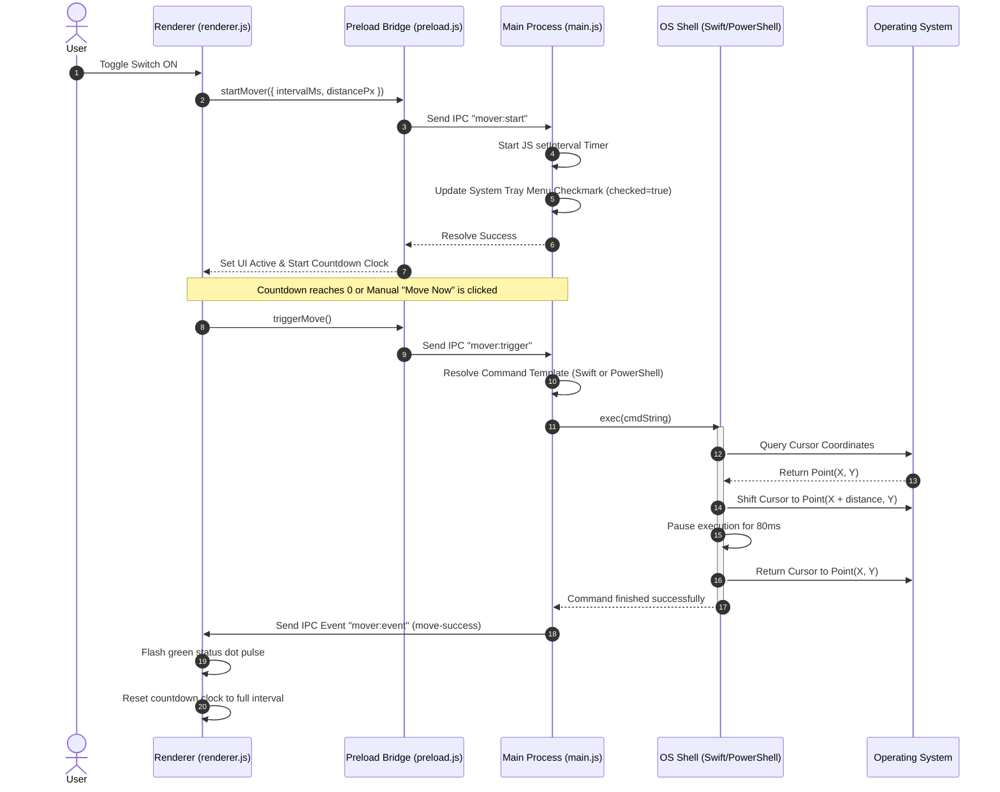

# Architecture Overview - Mouse Mover Pro

This document details the complete end-to-end architecture of **Mouse Mover Pro**, detailing how the Electron frontend interface, IPC bridge, main coordinator, and native OS shell execution layers collaborate to move the mouse cursor.

---

## 1. High-Level Architecture

Mouse Mover Pro is built on a 4-tier decoupled architecture designed for performance, security, and portability:

```
┌─────────────────────────────────────────────────────────────┐
│                      Renderer Layer (UI)                    │
│                 (HTML5 / CSS3 / Vanilla JS)                 │
└──────────────────────────────┬──────────────────────────────┘
                               │ UI Events & API Calls
                               ▼
┌─────────────────────────────────────────────────────────────┐
│                    Preload Layer (Bridge)                   │
│          (Context Isolation / Secure IPC Bindings)          │
└──────────────────────────────┬──────────────────────────────┘
                               │ IPC Messages
                               ▼
┌─────────────────────────────────────────────────────────────┐
│                     Main Layer (App Core)                   │
│              (Electron Main / Timer Coordinator)            │
└──────────────────────────────┬──────────────────────────────┘
                               │ Shell Exec (Node child_process)
                               ▼
┌─────────────────────────────────────────────────────────────┐
│                   Native OS Scripting Layer                 │
│         (macOS Swift / Windows .NET PowerShell)             │
└─────────────────────────────────────────────────────────────┘
```

---

## 2. Tier Breakdown

### Tier 1: The Renderer Layer (UI)
* **Files**: [index.html](file:///Users/santheep/Desktop/sandbox/robotjs/index.html), [style.css](file:///Users/santheep/Desktop/sandbox/robotjs/style.css), [renderer.js](file:///Users/santheep/Desktop/sandbox/robotjs/renderer.js)
* **Responsibility**: Controls what the user sees and interacts with.
* **Key Features**:
  * **Visual Clocks**: Calculates the dynamic SVG progress ring offset using:
    $$\text{dashoffset} = \text{Circumference} - \left( \frac{\text{secondsRemaining}}{\text{totalInterval}} \times \text{Circumference} \right)$$
    Where the circumference of the circle is $377\text{px}$ ($r = 60\text{px}$).
  * **Event Listeners**: Listens to changes in the sliders (Interval/Distance) and passes settings downstream.
  * **IPC Event Listeners**: Listens to responses from the Main Process (e.g., flashes green on `move-success` or displays red log details on `move-error`).

### Tier 2: The Preload Bridge
* **File**: [preload.js](file:///Users/santheep/Desktop/sandbox/robotjs/preload.js)
* **Responsibility**: Establishes a secure boundary between the frontend and dangerous Node.js APIs.
* **Key Features**:
  * **Context Isolation**: Exposes only clean, standardized API bindings to the window object via `contextBridge.exposeInMainWorld('electronAPI', ...)` while keeping `nodeIntegration: false`.
  * **IPC Router**: Translates frontend function calls (like `startMover()`) into Electron IPC channel invocations (`mover:start`).

### Tier 3: The Main Process (App Core)
* **File**: [main.js](file:///Users/santheep/Desktop/sandbox/robotjs/main.js)
* **Responsibility**: Manages the application lifecycle, tray icon menu rendering, UI window states, and the background execution timer.
* **Key Features**:
  * **System Tray & Menu**: Renders the macOS Menu Bar/Windows System Tray icon dynamically, syncing checkmarks with the active state.
  * **JavaScript Timer**: Rather than running active processes, it coordinates cycles using a standard `setInterval`.
  * **Dynamic Shell Spawner**: Runs native OS command-line interpreters (`swift` on Mac, `powershell` on Windows) asynchronously using Node's `child_process.exec`.

### Tier 4: Native OS Scripting Layer
* **Responsibility**: Leverages native, pre-installed compiler/interpreter systems on the host OS to manipulate the cursor.
* **Commands**:
  * **macOS (Swift & CoreGraphics)**:
    ```swift
    import Foundation
    import CoreGraphics
    let pos = CGEvent(source: nil)!.location
    let event1 = CGEvent(mouseEventSource: nil, mouseType: .mouseMoved, mouseCursorPosition: CGPoint(x: pos.x + distance, y: pos.y), mouseButton: .left)
    event1?.post(tap: .cghidEventTap)
    Thread.sleep(forTimeInterval: 0.08)
    let event2 = CGEvent(mouseEventSource: nil, mouseType: .mouseMoved, mouseCursorPosition: pos, mouseButton: .left)
    event2?.post(tap: .cghidEventTap)
    ```
  * **Windows (PowerShell & .NET)**:
    ```powershell
    Add-Type -AssemblyName System.Windows.Forms;
    $p = [System.Windows.Forms.Cursor]::Position;
    [System.Windows.Forms.Cursor]::Position = New-Object System.Drawing.Point(($p.X + distance), $p.Y);
    Start-Sleep -m 80;
    [System.Windows.Forms.Cursor]::Position = $p;
    ```

---

## 3. End-to-End Sequence Diagram

The diagram below details the sequence of events when a user toggles the switch to **Active**, waits for the countdown to hit zero, and triggers a mouse movement:



---

## 4. Key Architectural Design Decisions

### Why use `exec` instead of `spawn`?
`child_process.spawn` is designed for long-running stream interactions, whereas `child_process.exec` buffers shell execution, making it perfect for running quick, single-line commands (like our Swift/PowerShell scripts) that execute and exit in less than 200ms.

### Why does the UI handle the countdown instead of Main?
By delegating the countdown animation (seconds decrementing and progress ring updating) to `renderer.js`, we prevent IPC message flooding. Instead of sending an IPC message from Main to Renderer every single second (which consumes CPU/IPC channel resources), Main only sends messages when a move event actually completes (`move-success` or `move-error`), keeping resources extremely lean.

### Why warp the mouse back?
To prevent interrupting user operations. If a user is active on their screen, moving the cursor away permanently would be disruptive. The 80ms move-and-restore cycle shifts the mouse fast enough to prevent OS inactivity triggers, but restores it immediately so the user doesn't notice their cursor moving.
